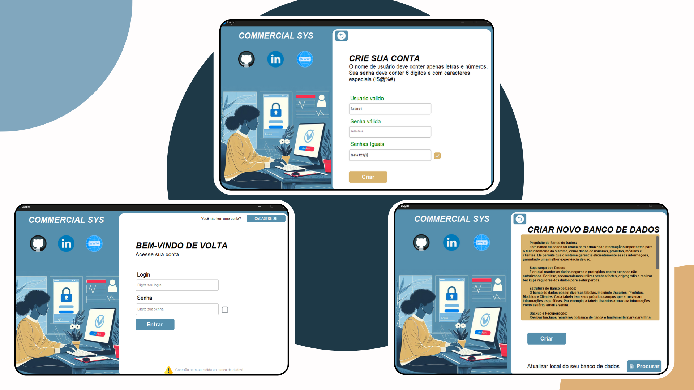
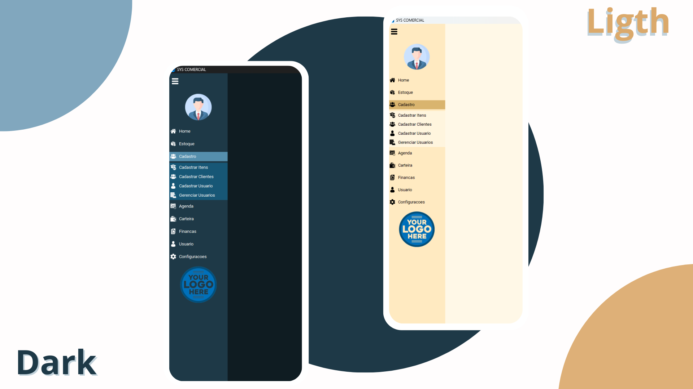
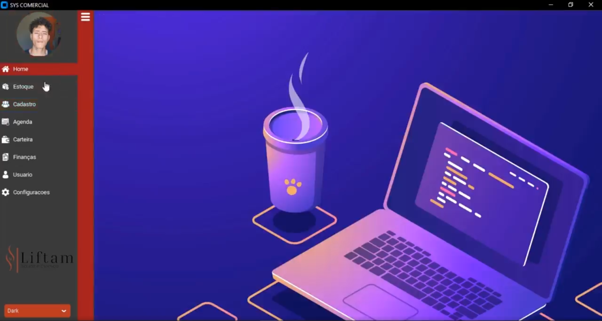
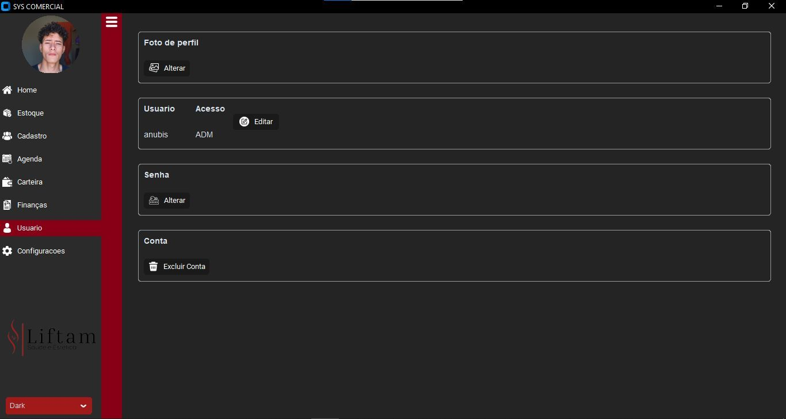
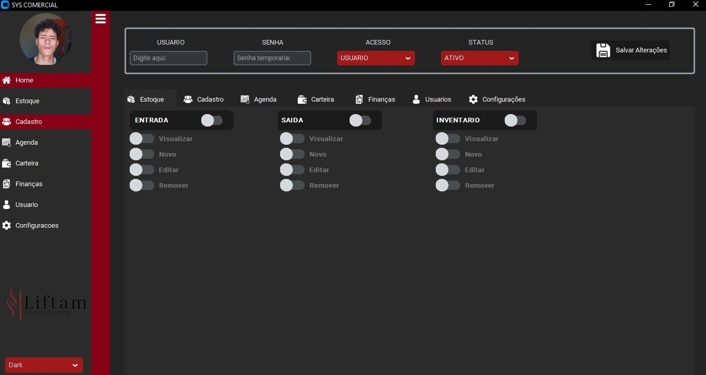
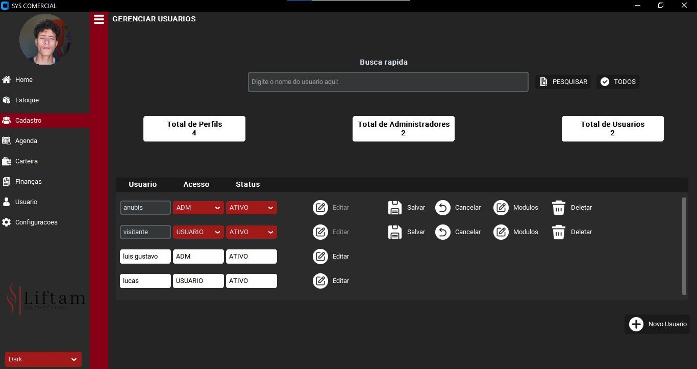
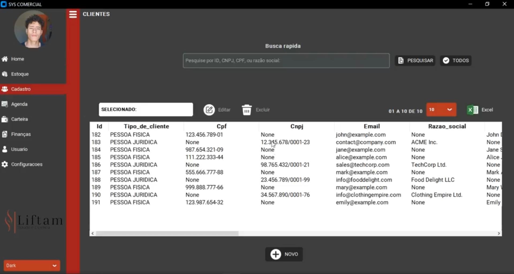
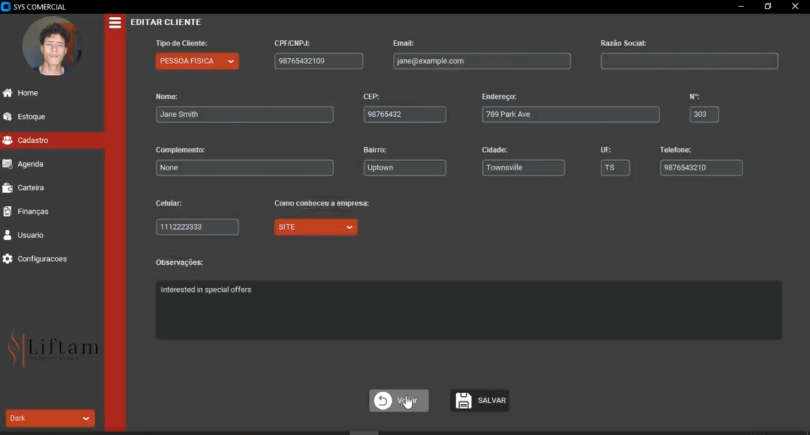
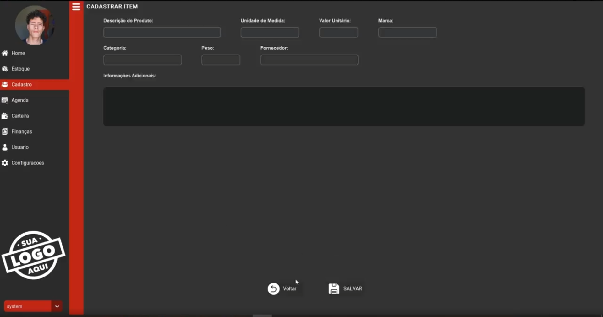

<div align="center">

# Sys Comercial

**Gestão para pequenas empresas que querem sair da planilha: estoque, cadastros, agenda, carteira, finanças e usuários em um app desktop em Python, customtkinter e SQLite.**




</div>

---

> **Em desenvolvimento.** Login, criação de conta, banco de dados, menu lateral e configurações (escala, cores e temas) já estão na versão nova. Os módulos de negócio estão sendo migrados da versão antiga, mostrada no fim deste README.

## Módulos

| Módulo | O que faz |
|---|---|
| **Home** | Painel inicial com acesso rápido aos módulos |
| **Estoque** | Produtos: adicionar, editar e excluir |
| **Cadastro** | Clientes, itens e usuários, com permissões por módulo |
| **Agenda** | Compromissos, reuniões e eventos |
| **Carteira** | Entradas e saídas |
| **Finanças** | Acompanhamento e análise financeira |
| **Usuário** | Dados do usuário logado |
| **Configurações** | Escala da interface, cores e tema (claro, escuro ou personalizado) |

## Requisitos

- Python 3.10 ou mais novo
- Pacotes em `requirements.txt`: customtkinter, Pillow e deep-translator (o SQLite vem com o Python)

## Instalação

```bash
git clone https://github.com/Luis-lhgdf/sys-comercial.git
cd sys-comercial
pip install -r requirements.txt

python Main.py
```

## Primeiro acesso

A tela de login tem três caminhos:

1. **Criar novo banco de dados** cria o arquivo SQLite com as tabelas `Usuarios`, `Produtos`, `Modulos` e `Clientes` e guarda o caminho em `src/data/database_location.txt`. Se você já tem um banco, **Procurar** aponta para ele.
2. **Cadastre-se** cria o usuário: nome só com letras e números, senha de 6 dígitos com pelo menos um caractere especial.
3. **Entrar** com o usuário criado.

## Temas

Claro e escuro, com cores personalizáveis em **Configurações**.

<div align="center">

</div>

## Estrutura

MVC simples:

```
Main.py                            ponto de entrada: conecta ao banco e abre o login
src/
  controllers/main_controller.py   liga as views ao model
  models/main_model.py             SQLite: criação das tabelas, login, cadastros
  models/carregar_img.py           carrega e redimensiona imagens
  views/
    main_view.py                   janela principal
    menu_view.py                   menu lateral recolhível
    Settings_view.py               configurações: escala, cores e tema
    customer_view.py, Product_view.py, user_view.py, new_user_view.py,
    Manage_users_view.py, base_registration_view.py
    appearance_manager.py          fontes e temas
    themes/                        tema atual e cores personalizadas (JSON)
    icon/                          ícones nas versões clara e escura
  utils/utils.py                   utilidades
  data/                            banco SQLite e o arquivo com o caminho dele
  CTkXYFrame/                      frame com rolagem nos dois eixos (componente de terceiros)
docs/                              prints usados neste README
```

## Versão antiga

Telas da primeira versão, que estão sendo refeitas no padrão novo.

<details>
<summary>Ver telas antigas</summary>
<br>

| Home | Informações do usuário |
|:---:|:---:|
|  |  |

| Cadastro de usuário | Gerenciar usuários |
|:---:|:---:|
|  |  |

| Clientes e itens cadastrados | Registrar cliente | Registrar item |
|:---:|:---:|:---:|
|  |  |  |

</details>

## Contribuição

Encontrou um problema ou tem uma sugestão? Abra uma issue ou envie um pull request.

---

## English

Desktop management system for small businesses moving off spreadsheets: inventory, customers and products, schedule, wallet, finances and user permissions, built with Python, customtkinter and SQLite (MVC). Light and dark themes with custom colors. **Work in progress**: login, database setup, side menu and settings are done; business modules are being ported from the previous version. Requires Python 3.10+. **Interface is in Portuguese.**

```bash
pip install -r requirements.txt
python Main.py
```

---

## Licença

MIT — veja [LICENSE](LICENSE).
